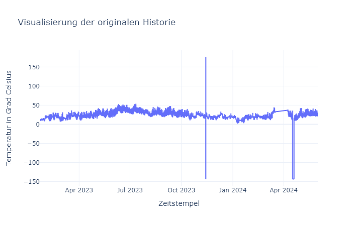
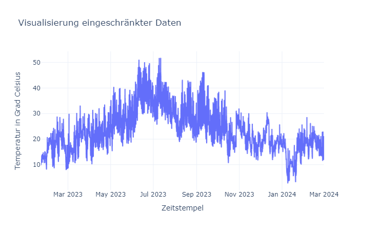
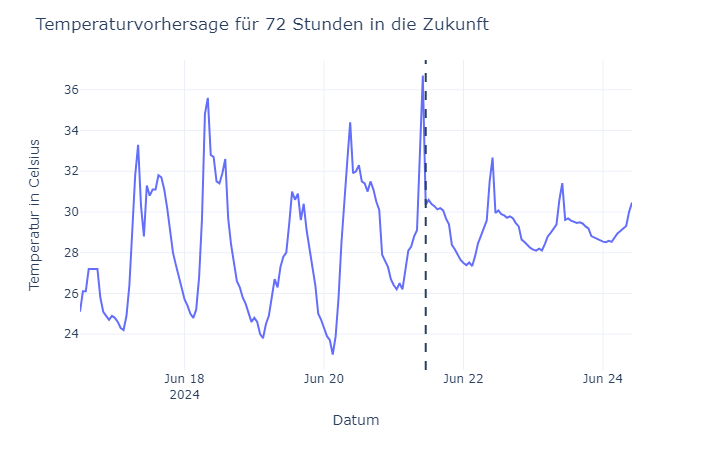
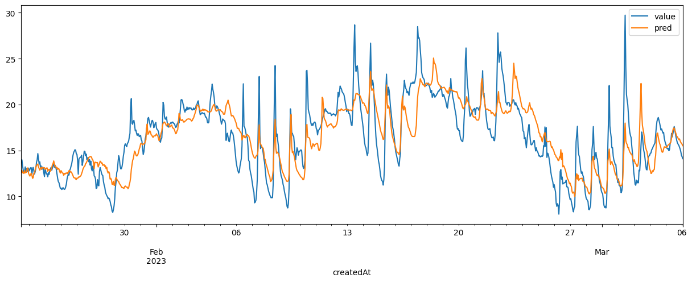

# Umweltmonitoring Labor-Projekt

Gruppenmitglieder:

- Lars Baumann, 84943

## Einleitung

Im Rahmen des Umweltmonitoring Projektes war es die Aufgabenstellung lauffähiges Live-Dashboard, zum Monitoring einer (oder mehrerer) senseBox(en) und zur Vorhersage ausgewählter gemessener Variablen, aufzustellen.

Das Dashboard in unserem Fall soll den Nutzern anzeigen wo die senseBox ist, wie die Temperaturen in der nahen Vergangenheit aussehen, was unser Modell an Werten für die nahe Zukunft vorhersagt und wie die Temperaturen aktuell assehen.

## Umsetzung

### Dashboard Layout

Für das Dashboard habe ich mir 4 Elemente überlegt. Eine Karte für den Standort der senseBox auf der linken Seite und für die Rechte Seite 3 Graphen zur Visualisierung der nahen Vergangenheit, der Vorhersage der Temperaturen für die nächsten 3 Tage und der Live Daten.

Für das Dashboard wurde Dash verwendet.

### Datenbeschaffung

Als Datenquelle habe ich mich für eine senseBox aus Köln entschieden. Von dieser wurde für das Vorhersagemodell ein Temperaturdaten-Dump heruntergeladen mit Daten von Anfang 2023 bis Anfang 2024. Für das Dashboard wird außerdem ad-hoc ein Datensatz mit den Daten von der letzten Woche, respektiv zum Ausführzeitpunkt, geladen.

### Datenhaltung

Da ich nur lokal auf einer Maschine gearbeitet habe, beschränkt sich die Datenhaltung auf ein Dateiverzeichnis mit CSV-Dateien der Temperaturdaten die geladen werden, wenn das Dashboard ausgeführt wird.

### Vorhersagemodell

Das Vorhersagemodell wird auf Stundenniveau Vorhersagen für die 3 Tage in die Zukunft machen. Iterativ erklären?

#### Vorverarbeitung

Bei dem Datendump ist aufgefallen, dass es keine direkten Fehlwerte gibt. Zwischen November 2023 und Dezember 2023 gab es einzelne Fehlmessungen, was zu erkennen ist an den exorbitant hohen und niedrigen Werten. Von Ende März bis Anfang April hat die senseBox keine Daten gesendet. Mitte April hat die Box erneut Fehlmessungen zu verzeichnen.

Die Fehlmessungen wurden entfernt und linear interpoliert. Da ab Ende März ein großes Datenloch auftretet, wird der Datensatz auf den Zeitraum Anfang März 2023 bis Anfang März 2024 beschränkt.

#### Das Modell

Als Features für das Modell wurden 2 Lag-Features erstellt und ein gleitender Mittelwert der Temperaturen der letzten 24 Stunden. Aufgrund dieser Features muss das Modell, um Vorhersagen für die nächsten 72 Stunden zu treffen, seine eigenen Vorhersagen als Input für seine Vorhersagen nehmen. Das führt dazu, dass das Model immer ungenauer wird desto weiter es die Temperaturen in die Zukunft vorhersagen muss. Im folgenden Graphen ist dieses Phänomen gut zu erkennen, hier ist der Vorhersagezeitpunkt mit der gestrichelten Line gekennzeichnet, alle Datenpunkte die danach kommen hat das Modell anhand seiner eigenen Vorhersagen aufgestellt.

Die Vorhersagen nähern sich immer mehr einem Mittelwert an je weiter es in die Zukunft geht. Obwohl das Modell nicht sehr optimiert ist und anhand eigener Vorhersagen mehr Vorhersagen aufstellt, kann es die Trends relativ gut erfassen und solange es keine Extremwetterereignisse gibt, wird das Modell nicht komplett mit seinen Vorhersagen falsch liegen.

Der folgende Graph zeigt einen wichtigen Schritt im Modelltraining, das Vorhersagen auf Testdaten. Die Testdaten wurden dem Modell vorenthalten, damit das Modell zur Auswertung auf dem Modell unbekannten Daten getestet wird.

Dieser Graph zeigt, dass im Großen und Ganzen das Modell ziemlich fähig scheint immer wieder auftretende Muster zu erkennen und gute Vorhersagen zu treffen. Jedoch kann man auch sehen, dass das Modell mit kurzfristigen Musteränderungen, wie etwa der Temperaturverlauf vom 30. Januar bis 1 Februar, zu kämpfen hat und stark von den eigentlichen Temperaturen abweicht.

Das mittlere Fehlerquadrat liegt bei ungefähr 8.6 und die Wurzel davon bei ungefähr 2,9. Das deutet darauf hin, dass das Model im Durchschnitt um etwa 3 °C daneben liegt.

### Wie geht es weiter?

In weiterführenden Schritten könnte man das simple lineare Modell mit einem anspruchvolleren Modell für Zeitreihen ersetzen, ich denke da an SARIMAX. Das wäre für diesen Anwendungsfall sehr passend, da es auf Zeitreihenvorhersagen zugeschnitten ist die eine gewisse Saisonalität aufweisen und es exogene Variablen erlaubt, wodurch auch komplexere Zusammenhänge, die Einfluss auf die Temperatur haben könnten, abgebildet werden können.
